# 12 Best Cookie Consent Platforms in 2025

Look, here's the thing about cookie consent — it's one of those things nobody really wants to deal with until they absolutely have to. You're running a website, things are going great, and then someone mentions GDPR or CCPA and suddenly you're down a rabbit hole of regulations that makes your head spin.

The good news? You don't have to become a privacy lawyer to get this right. Cookie consent platforms exist to do the heavy lifting for you — scanning your site, blocking scripts until users say yes, keeping records of who agreed to what, and generally making sure you're not accidentally breaking laws in seventeen different countries. The tricky part is figuring out which one actually fits your needs without overpaying or getting stuck with something that requires a computer science degree to operate.

So here's what we found after digging through the options that are actually worth your time.

## **[Cookiebot](https://www.cookiebot.com)**

The platform that makes GDPR compliance feel less like a legal nightmare and more like checking off a simple to-do list.

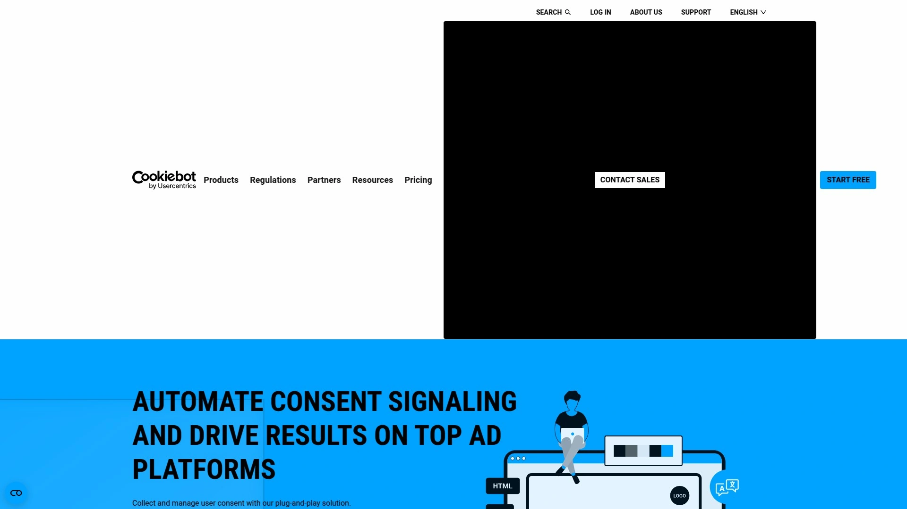

Cookiebot built its reputation on one core thing: automatic detection that actually works. The platform runs monthly scans across your entire domain, finds every cookie and tracker hiding in your code, then categorizes them without you having to manually dig through technical documentation. This matters because most websites have way more cookies than their owners realize — third-party widgets, analytics tools, embedded videos, all of it gets tracked and sorted automatically.

The consent banner itself is surprisingly flexible. You get full control over design, from colors and fonts to button placement and messaging, so it doesn't look like some generic popup slapped onto your site. It supports over 47 languages with automatic translation based on visitor location. When someone from France visits, they see French text and EU-compliant options. Someone from California gets CCPA-appropriate choices.

What really sets it apart is the blocking mechanism — it auto-blocks all non-essential cookies and trackers before consent happens. No manual script tagging required. Integration with Google Consent Mode means your analytics keep working even when users decline certain categories, just in privacy-friendly ways. The platform stores consent records securely on EU-based servers, gives you downloadable logs for audits, and handles consent renewal requests automatically.

Works seamlessly with WordPress, Shopify, Drupal, and pretty much every major CMS through simple JavaScript implementation. Pricing scales with your site size starting around €13/month for smaller sites, with a free plan available for sites under 50 pages.

## **[OneTrust](https://www.onetrust.com/products/cookie-consent/)**

Enterprise-grade consent management that handles complexity without making you hire a dedicated privacy team.

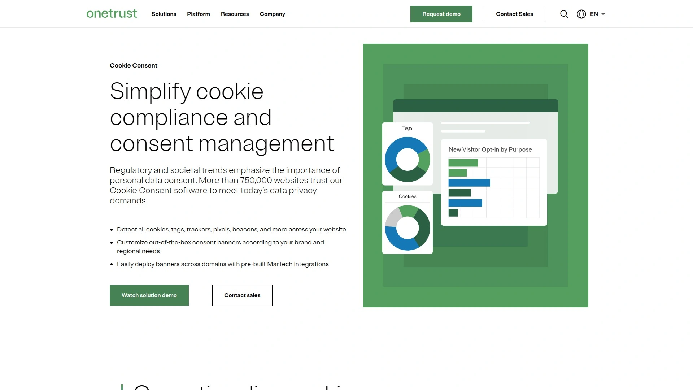

OneTrust operates at a different scale than most tools in this space. Over 750,000 websites trust their cookie consent software, which tells you something about reliability. The platform uses advanced scanning that simulates actual user experiences — it can scan behind login walls, trigger hidden pages, and find cookies that only load under specific conditions. This depth matters for complex sites with member areas or dynamic content.

The cookie database contains over 45 million pre-categorized cookies. When the scanner finds a cookie, it automatically pulls the description, vendor information, lifespan, and purpose from this database. Less manual data entry, faster setup. Template customization supports more than 250 languages with geolocation rules that display different banners and consent models based on region, country, or even state-level regulations.

Built-in A/B testing lets you experiment with template variations and measure consent rates. You can define custom logic, sync consent for known users across devices, and extend the system to mobile apps and connected TV platforms. Integration options include tag manager connections and script re-writing for automatic blocking.

The platform appeals to mid-sized businesses and enterprises dealing with multiple domains, complex tracking setups, or strict compliance requirements across different jurisdictions.

## **[CookieYes](https://www.cookieyes.com)**

Google-certified consent management that prioritizes ease of use without sacrificing compliance depth.

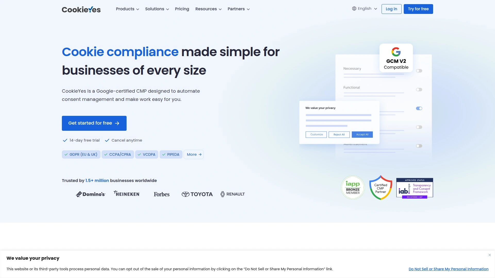

CookieYes built its platform around a simple idea: getting compliant shouldn't take days of setup. The system lets you deploy a fully functional cookie banner in literally minutes — select a template, customize colors and text, copy one line of code, paste it in your site header. The interface guides you through each step with setup documentation for every major CMS.

Automated consent management handles the repetitive work. Monthly scanning runs automatically and updates your cookie declarations without manual intervention. Script blocking happens automatically based on user preferences — if someone declines marketing cookies, those scripts never load. Consent logs get stored centrally with timestamps and user choices recorded for compliance audits.

The platform integrates directly with Google Tag Manager, supports Consent Mode V2, and maintains IAB TCF v2.2 certification for advertising compliance. Geotargeting adjusts banner behavior based on visitor location, showing EU visitors full opt-in banners while presenting different formats for California or Brazil.

Banner customization includes multiple layout options, full color control, custom CSS for advanced styling, and the ability to link directly to your privacy policy. Works with WordPress, Joomla, Drupal, Wix, Squarespace, and other platforms through native plugins or direct code installation.

Free plan available with basic features, then paid plans unlock automatic policy updates, multi-language support, and removal of platform branding.

## **[Termly](https://termly.io)**

All-in-one compliance platform that bundles cookie consent with legal document generation.

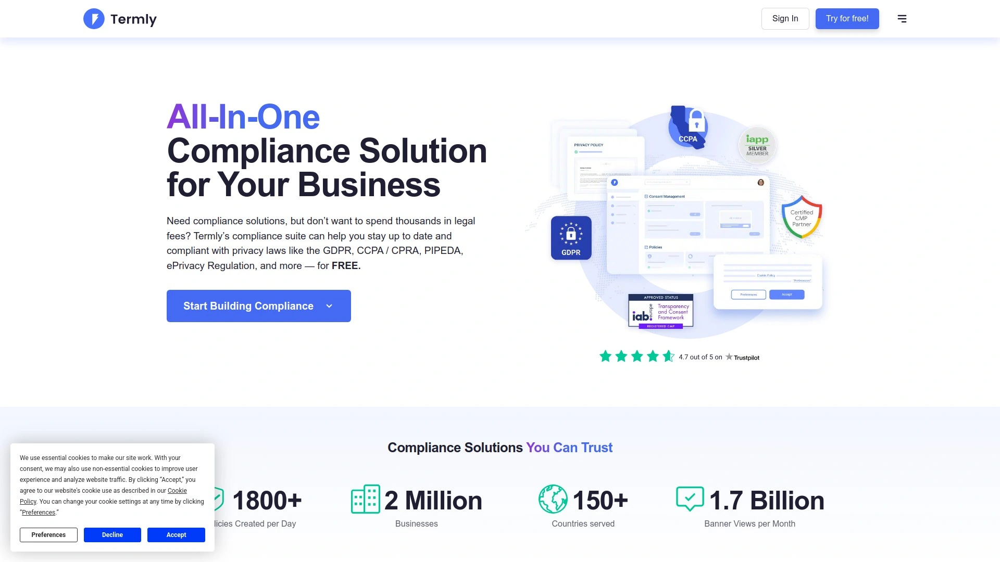

Termly takes a broader approach to compliance by combining cookie management with privacy policy generation. This matters because GDPR and CCPA don't just require consent banners — they also mandate specific disclosures in your privacy documentation. Having both tools in one platform means your cookie banner and privacy policy stay synchronized automatically.

The cookie scanner detects and categorizes all trackers, then auto-blocks them until consent is obtained. Geotargeting ensures visitors from different regions see appropriate consent flows — explicit opt-in for EU visitors, opt-out mechanisms for California users. Multi-language support covers over 10 languages across 25+ regions.

Consent logs store detailed records of user decisions with timestamps for regulatory proof. The Data Subject Access Request form builder helps you create and manage requests from users wanting to see what data you've collected. Template coverage supports 28 global privacy laws including GDPR, CCPA, LGPD, and various state-level regulations.

As a Google CMP Gold Partner, Termly fully integrates with Google Consent Mode v2 and supports IAB TCF v2.2 for advertising networks. The platform offers quarterly cookie scans, 10,000 monthly consent banner views, and basic features on the free plan, with paid plans starting around $10/month for automatic updates and advanced options.

## **[Osano](https://www.osano.com/solutions/consent-management-platform)**

User-friendly CMP that simplifies global compliance without drowning you in technical details.

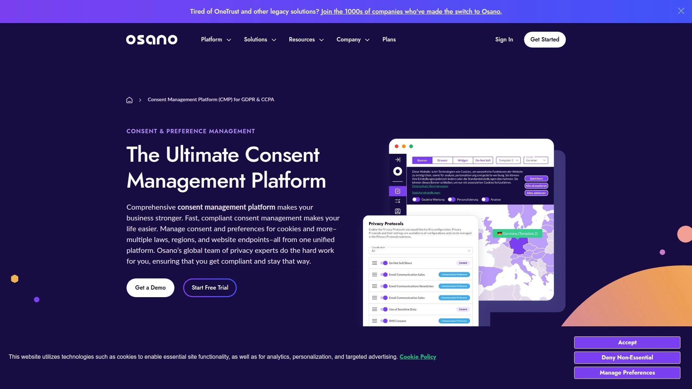

Osano designed their consent management platform around the idea that privacy compliance shouldn't require engineering expertise. The configuration setup takes just a few minutes — enter your domain, link to your privacy policy, choose your consent approach, and the system generates the necessary code. Advanced settings let you enable Global Privacy Control, integrate with IAB frameworks, and activate Google Consent Mode without diving into documentation.

The curated block list automatically prevents scripts and cookies deemed illegal in certain regions from loading. This proactive blocking reduces compliance risk by stopping problematic trackers before they become issues. First-layer categories give you control over whether visitors see all opt-in categories upfront or a simplified "Manage Preferences" button.

Cross-domain support shares initial consent across multiple properties owned by the same entity. US state-level legislation support lets you switch between opt-in and opt-out dialogs depending on jurisdiction. The platform maintains separate cookie configurations for different domains while centralizing management in one dashboard.

Cookie duration follows regional requirements — six months for Ireland, France, and French territories, twelve months elsewhere. Consent tracking includes unique user IDs for lookup purposes and expiration dates for automatic renewal.

Pricing tiers accommodate businesses of different sizes with varying feature access based on subscription level.

## **[Usercentrics](https://usercentrics.com)**

Leading European consent platform trusted by over 2 million websites for sophisticated consent orchestration.

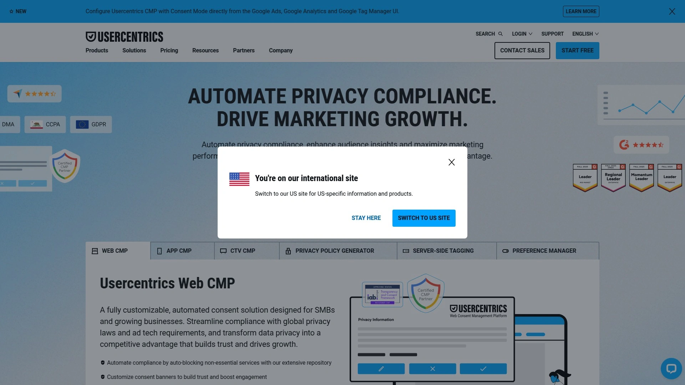

Usercentrics processes more than 6.3 billion user consents monthly, which gives you some perspective on the scale they operate at. The platform offers two main products — Usercentrics CMP for complex enterprise needs and Cookiebot CMP for small-to-medium businesses, giving you options based on your situation.

The DPS Scanner automatically identifies third-party services, cookies, and trackers across your site with suggested categorizations. Legal framework selection happens during setup, with Google Consent Mode enabled by default and multi-language support built in. The configuration interface lets non-technical teams manage consent rules, customize banner appearance, and adjust settings without developer involvement.

Banner customization includes design matching, multiple layout options, and content adjustments from dedicated tabs. Implementation works through direct JavaScript embedding or Google Tag Manager template deployment. Integration with Google Consent Mode requires minimal additional setup when using the Tag Manager template.

Secure consent storage happens in EU-based data centers with download options for compliance documentation. The platform supports 47+ languages with automatic localization based on visitor browser settings.

Usercentrics maintains compliance with GDPR, DMA, CCPA, LGPD, and various other regional privacy regulations through geo-targeted banner displays and region-specific consent flows.

## **[Iubenda](https://www.iubenda.com/en/help/1177-cookie-solution-getting-started)**

Privacy controls that combine cookie consent with comprehensive legal document generation.

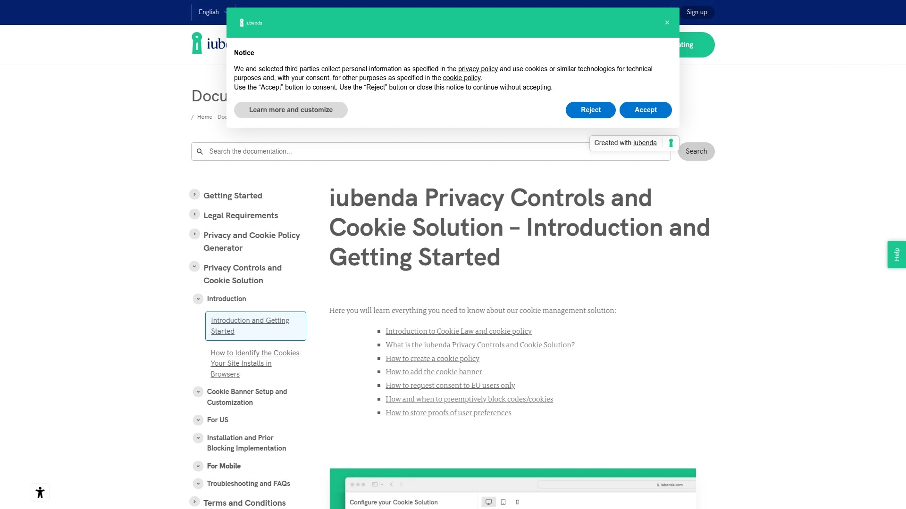

Iubenda approaches consent management as part of a larger privacy compliance toolkit. The Privacy Controls and Cookie Solution handles banner display, script blocking, and consent logging while simultaneously generating the required legal documentation. This integrated approach means your cookie policy automatically updates when the scanner detects new cookies.

Banner configuration offers extensive customization options for appearance, messaging, and behavior. You control consent types, display timing, button styling, and user preference options through a visual interface. Multi-language support and geotargeting ensure appropriate consent flows for visitors from different regions.

The platform integrates with major CMS platforms including WordPress, Shopify, and others through native plugins. WordPress integration specifically offers seamless setup with all-in-one compliance features for GDPR and CCPA requirements. Script blocking prevents cookies and trackers from loading until explicit user consent is received.

Documentation generation covers privacy policies, cookie policies, terms and conditions, and other required legal pages. The system monitors regulatory changes and updates your documents accordingly, reducing the need for constant legal review.

Setup process remains straightforward across different platforms with guided configuration and clear implementation instructions.

## **[CookieScript](https://cookie-script.com)**

Google-certified CMP ranked highly for small business implementation and ease of use.

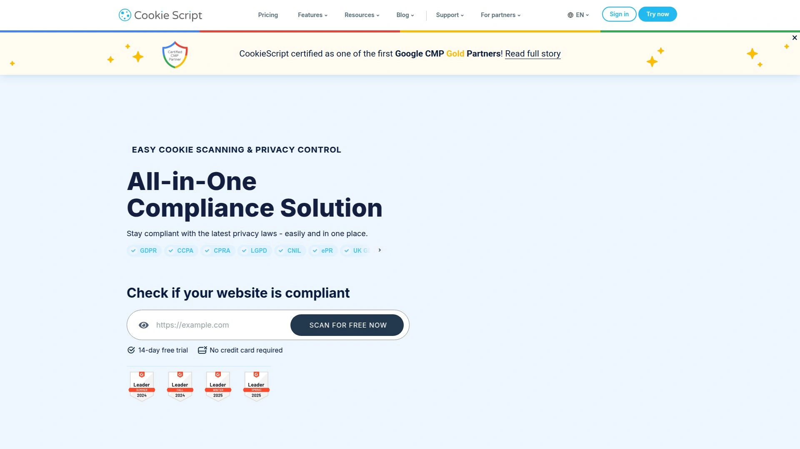

CookieScript earned recognition as one of the best CMPs for small businesses on G2 in 2024. The platform maintains Google Gold-tier certification, demonstrating compliance with Google's requirements for third-party services. This certification matters for sites heavily invested in Google's advertising and analytics ecosystem.

Cookie scanning technology identifies all cookies and trackers across your domain automatically. Categorization happens based on cookie purpose, with automatic blocking of non-essential cookies until consent is obtained. The consent banner supports customization for layout, colors, messaging, and button options.

Integration with major analytics and advertising platforms happens through built-in connections. Google Consent Mode support ensures your tracking continues in privacy-compliant ways even when users decline certain categories. Geo-targeting displays appropriate banners based on visitor location and applicable regulations.

Multi-language support covers 30+ languages with automatic translation based on browser settings. Consent logs maintain detailed records of user choices with timestamps and preference details. The platform provides proof of consent documentation for regulatory audits or user requests.

Implementation requires adding the CMP script to your website's head section before other custom scripts. Setup guides walk you through installation for different platforms and configurations.

## **[Axeptio](https://www.axept.io/cookie-banner)**

Consent experience platform that turns compliance moments into engaging brand interactions.

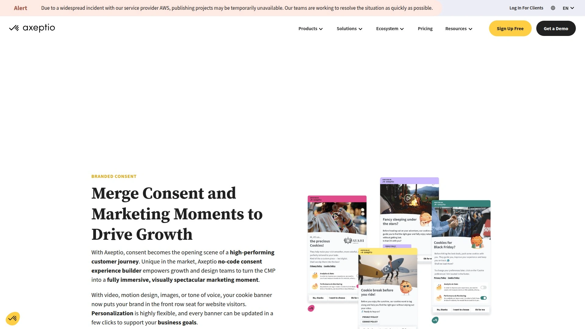

Axeptio takes a completely different approach to consent banners by treating them as marketing opportunities rather than legal obligations. The no-code Consent Experience Builder lets growth and design teams create visually spectacular, fully branded consent moments that feel like natural extensions of your site experience.

Customization goes beyond standard color and text changes. You can add wide hero images at the top of your banner, embed videos, incorporate motion design, use custom illustrations, and adjust tone of voice to match your brand personality. The signature cookie character illustrations have become a hallmark of the platform, adding personality to what's usually a dry compliance moment.

Technical compliance remains solid despite the design focus. The platform supports GDPR, CCPA, and Law 25 compliance with Google Consent Mode v2 integration. Cookie scanner reveals all cookies on your site with automatic reporting. A/B testing and consent walls help optimize consent rates.

Analytics provide detailed insights into consent performance with the ability to compare against industry benchmarks. Integration works with Adobe Analytics, Google Analytics 4, Google Tag Manager, and other major platforms. Mobile optimization ensures banners look great and function properly across devices.

Free plan covers up to 200 visitors monthly, with paid plans starting at $29/month for 5,000 pageviews.

## **[Enzuzo](https://www.enzuzo.com/blog/best-consent-management-platforms)**

Enterprise consent solution built for mid-market companies seeking robust features without enterprise pricing.

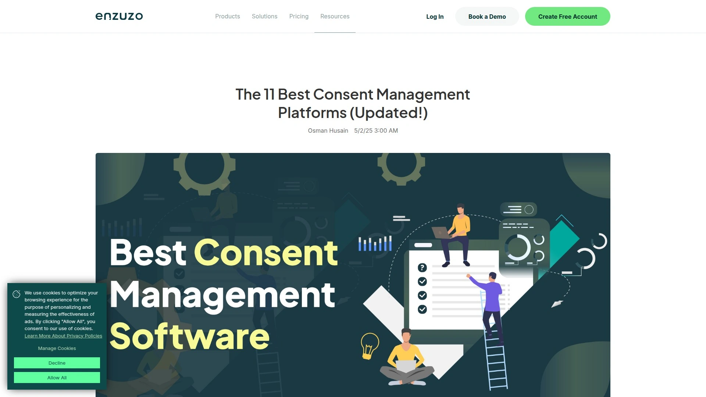

Enzuzo positions itself as the ideal solution for growing companies that need more than basic consent management but can't justify OneTrust-level costs. As a Google CMP-certified vendor, the platform ensures compliance with Google Consent Mode requirements. Regulatory support covers GDPR, CCPA, Quebec Law 25, Brazil's LGPD, and South Africa's POPIA.

The consent manager integrates with tag managers and content management systems through straightforward connections. Historical consent database maintains detailed records for regulatory audits and compliance verification. Geo-specific cookie banners display automatically based on visitor location, showing appropriate consent options for each jurisdiction.

Comprehensive website scanning uncovers existing cookies with categorization and documentation. Staging site testing lets you validate configurations before pushing changes live. Multi-domain consent storage shares preferences across different properties. API access enables custom consent programs for specialized requirements.

Advanced analytics provide opt-in statistics, performance metrics, and detailed reporting. Banner customization supports pre-built templates with extensive CSS customization options for fonts, colors, messaging, logos, and layout.

The platform appeals particularly to global enterprises like Lucy Group that need consistent privacy management across multiple regions and properties.

## **[Complianz](https://complianz.io)**

WordPress and Shopify specialist trusted by over 1 million users for native privacy compliance.

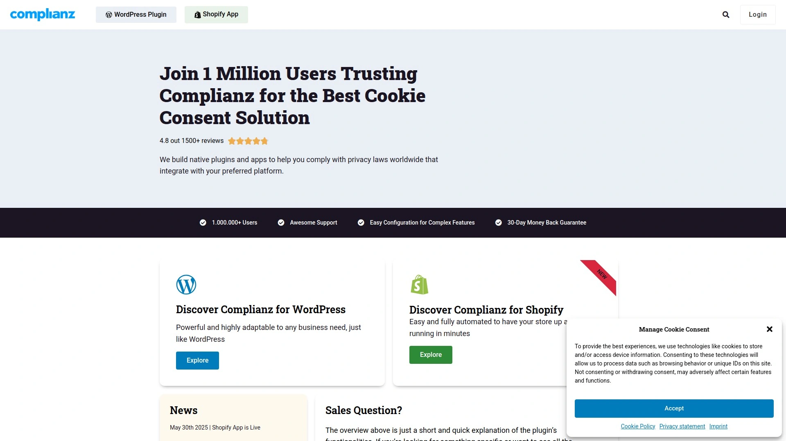

Complianz built its reputation specifically around WordPress and Shopify integrations. The platform offers native plugins designed specifically for these ecosystems rather than generic JavaScript solutions. This focused approach means deeper integration, better performance, and fewer compatibility issues.

The two-step setup process auto-detects cookies and configures your banner without coding or manual entry. Cookie scanning identifies all tracking technologies automatically with proper categorization. Auto-blocking prevents non-essential scripts from loading until consent is received, with full integration into Shopify's privacy API.

Regional compliance support covers GDPR, ePrivacy, CCPA, LGPD, POPIA, and multiple other frameworks. Consent management adapts per region, including different cookie banner displays and legal document requirements. The platform handles script management differently based on visitor location, ensuring appropriate treatment for each jurisdiction.

Records of consent feature stores detailed logs including cookie policy snapshots, anonymized IP regions, timestamps, category selections, and user IDs. Proof of consent PDFs can be generated for regulatory audits or user requests. Banner customization offers extensive styling options to match site design.

Google Consent Mode v2 and IAB TCF v2.2 support ensures compatibility with modern advertising requirements. Multi-language support includes English, German, Italian, Dutch, Spanish, and French.

## **[Didomi](https://www.didomi.io/consent-management-platform)**

Global consent platform specializing in multi-regulation compliance for international businesses.

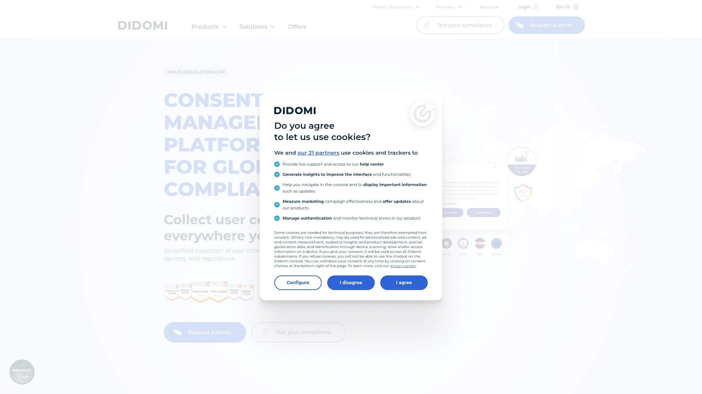

Didomi focuses heavily on organizations operating across multiple jurisdictions with different privacy requirements. The platform handles GDPR in Europe, CCPA/CPRA in the US, LGPD in Brazil, and various other regional frameworks through unified management. Geo-targeting displays appropriate consent banners based on user location with rules managed centrally in the admin console.

Integration with major industry frameworks includes Google Consent Mode, Microsoft UET Consent Mode, and IAB Transparency and Consent Framework. These certifications ensure compatibility with advertising platforms and analytics tools. The platform maintains constant communication with industry groups to stay current with framework updates.

Banner personalization creates unique consent experiences optimized for higher opt-in rates. Design customization supports 45+ languages with automatic language detection based on browser settings. A/B testing capabilities let you experiment with different approaches and measure consent performance against industry benchmarks.

The admin interface is designed for non-technical teams to manage core features through intuitive UI-based tools. Technical users can leverage developer-friendly documentation for advanced configurations. Consent rate benchmarking provides exclusive insights comparing your performance with industry peers.

The platform processes consent across all domains, devices, and regulations while maintaining centralized proof of user choices.

## **[Silktide](https://silktide.com/consent-manager/)**

Open-source cookie banner offering 100% free GDPR-compliant consent management.

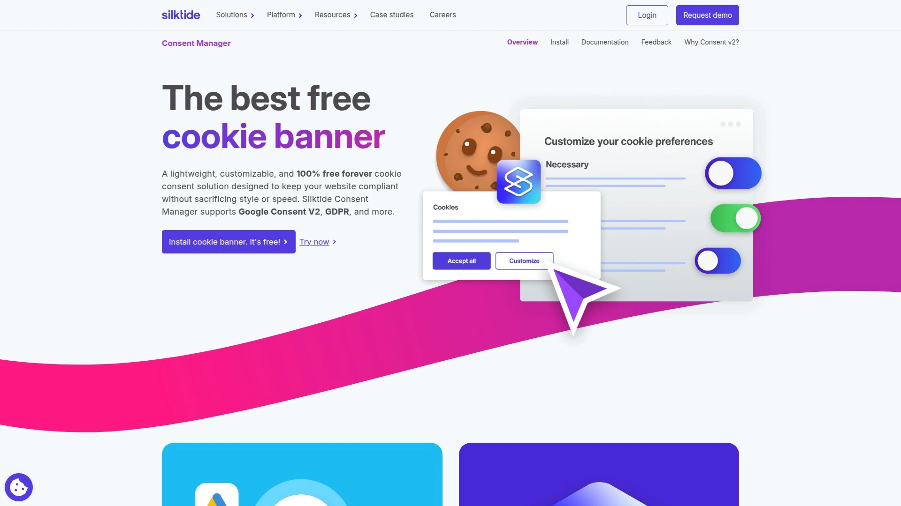

Silktide took an unusual approach by releasing their consent manager as completely open-source and free. No hidden costs, no premium tiers, no feature limitations. The banner was designed specifically with GDPR and ePrivacy directives in mind from the ground up.

Users maintain full control over their personal data through clear consent options. The platform handles cookie detection, preference management, and consent storage without requiring payment or registration. Implementation involves adding the open-source code directly to your site.

Integration options include Webflow and other major platforms. The free nature makes it particularly appealing for small businesses, nonprofits, and anyone operating on tight budgets. Community-driven development means ongoing improvements and updates from contributors.

GDPR compliance guidance extends beyond just the cookie banner, with Silktide offering comprehensive resources for website owners navigating data privacy requirements. The platform provides broader data privacy tools and solutions alongside the free consent manager.

For organizations that want basic GDPR compliance without ongoing subscription costs, Silktide offers a straightforward solution backed by open-source transparency.

## How do I choose between opt-in and opt-out consent models?

Your choice depends entirely on where your visitors are located and which laws apply to them. EU visitors under GDPR and ePrivacy Directive require explicit opt-in consent — you must get active permission before setting non-essential cookies. This means showing clear options and requiring an affirmative action like clicking "Accept". California users under CCPA can use opt-out consent where cookies load by default but users can refuse them. The best CMPs handle this automatically through geotargeting, showing the correct consent type based on visitor location.

## What happens if users reject my cookie banner?

When users decline cookies, non-essential scripts shouldn't load at all. Marketing cookies, analytics trackers, and advertising pixels get blocked while necessary cookies for site functionality continue working. Some features might not work as expected — embedded videos might not play, chat widgets might not appear, personalization disappears. However, Google Consent Mode lets you still gather aggregate, non-identifying insights and show contextual ads instead of targeted ones, so you're not completely flying blind. The key is respecting user choices while maintaining basic site functionality.

## Do I need to store proof of consent?

Yes, GDPR and most other privacy laws require you to document that you obtained proper consent. This means storing records that show what users agreed to, when they agreed, what version of your cookie policy was active, and what options they were given. Good CMPs maintain these consent logs automatically with timestamps, user IDs, and preference details. If a regulatory authority audits you or a user requests their data, you need to produce this proof. The documentation should include the consent banner they saw, the choices they made, and when their consent expires.

## Wrapping up

Here's what it comes down to: cookie consent isn't optional anymore, but it also doesn't have to be complicated. The platforms listed here handle the technical heavy lifting — scanning, blocking, logging, updating — so you can focus on actually running your website instead of becoming a privacy law expert.

For most situations, [Cookiebot](https://www.cookiebot.com) hits the sweet spot of powerful automation, flexible customization, and straightforward implementation. The monthly scanning catches changes automatically, the blocking works without manual configuration, and the pricing scales reasonably as your site grows. Whether you're dealing with EU visitors requiring strict GDPR compliance or California users under CCPA, the geotargeting handles the differences without you having to think about it.
